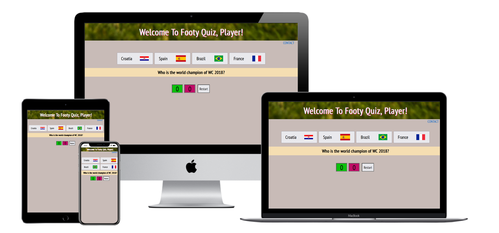
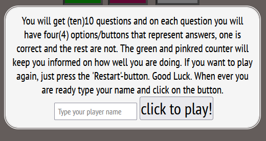
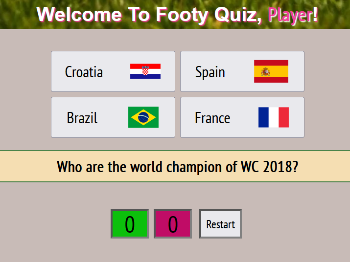
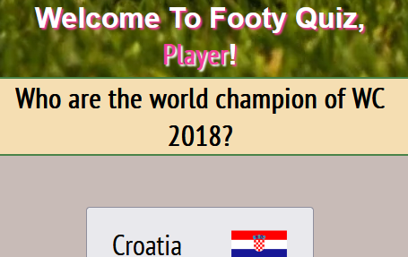
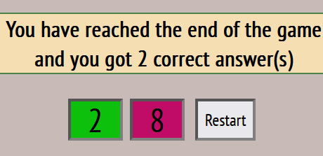
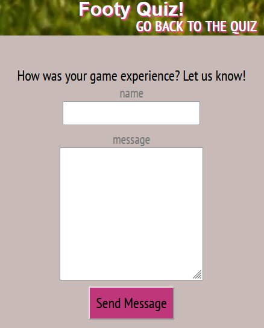
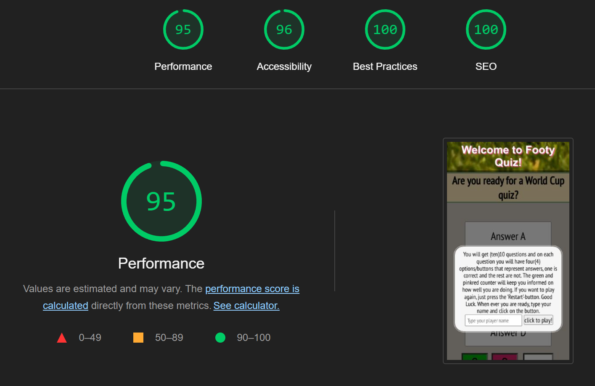

# FootyQuiz

[View the live project here.](https://awrelh.github.io/FootyQuiz/)

This is the smallest football quiz for the fans of the biggest sport in the world.

<h2 align="center"></h2>

## User Experience (UX)

-   ### User story/goal

    As a user I want to play a quiz that is straight forward. 
    This is the question and those are the alternatives. I want to see how I progress while playing and at some point the game will let me know that the game if finished. I want to be challenged with questions that regards football and hopefully learn something. 

- ### Site owner's goal

The goal is to provide a challenging quiz yet entertain the online user. 

### Initial 

-   ### Design
    -   #### Color Scheme
        -  the color scheme I have used.
        
        
        
            I've used the HSL set-up because its efficent way to grade up and down through the colors. Also keep the colors consistent.
    -   #### Typography
        -   The font family I've used is Kanita, PT Sans Narrow, Sansita, sans-serif.
    -   #### Imagery
        -   I've used a banner image of a stadium and a ball on top, behind the welcome-text. And the additional imagery is only complementing some questions where I found it adding value to the questions, flags for countries for example. 
    -   #### Two CSS-files
        -   I created two different CSS files to separate them because some of it was a not needed in contact.html and gave a better workflow. 
*   ### Wireframes

    -   Home Page Wireframe - [View](assets/images/forREADME/footyQuizDesktop.png), clearly some changes that came along the project, removing of the highscore and suggestion textarea. Suggestion is added in separate page.

    -   Mobile Wireframe - [View](assets/images/forREADME/footyQuizMobile.png)

## The questions
    The questions are just a creation of imagination with a little bit of googling facts. Some are regarding dates, teams and players. Also there's one random question about an instrument had a big inpact on the stadium environment. 

## Features
 
-   Responsive on all device sizes

-   Interactive game for everyone, but especially football lovers

-   Possibility to give feedback to creator or suggest questions

## Walkthrough of project
-    When entering page you will be greated with instruction, possibility of typing your name and a button. The input value will later be displayed on welcome title, if null it will display 'Player'.
    
    
-   The game features are straight forward five buttons to interact with, two number boxes that keeps the score of answers questions, wrong or right. And you have a question-bar that reveals questions.  

-   About the questionbar, it will move up underneath the welcome title if screen is smaller than 600px. 

-   When completed the 10 questions you will have get an message about that. Also another box will appear displaying all the correct answers to user in a details-element. In same style as the other boxes 

- It's also possible for user to contact creator via link that is in the footer. 

-   The contact page is very straight forward, a form with name and textarea and a submit-button. And you are able to return to quiz-page when clicking on the link in the banner. The submit button changes value when pushed to 'sending...' and an alert message appears when message has been sent. When clicking it you will have an empty form.   

## Technologies Used

### Languages Used

-   [HTML5](https://en.wikipedia.org/wiki/HTML5)
-   [CSS3](https://en.wikipedia.org/wiki/Cascading_Style_Sheets)
-   [JavaScript](https://en.wikipedia.org/wiki/JavaScript)

### Frameworks, Libraries & Programs Used

1. [Google Fonts:](https://fonts.google.com/)
    - Google fonts were used top import fonts into the style.css file which is used on both pages.
1. [Git](https://git-scm.com/)
    - Git was used for version control, use of commands as git add, git commit, git push. 
1. [GitHub:](https://github.com/)
    - GitHub is used to start the project via code Institute template, and was coded on gitpod.io. 

1. [Balsamiq:](https://balsamiq.com/)
    - Balsamiq was used to create the wireframes during the start of project.

1. Windows Snippet tool
    - Was used to snippet images to readme.md

## Testing

The W3C Markup Validator and W3C CSS Validator Services were used to validate the pages of the project and make sure code is correct. Also JSHint was used to validate the JavaScript. And Chrome Lighthouse devtool was used as well.

-   [W3C Markup Validator](https://jigsaw.w3.org/css-validator/#validate_by_input) - no errors were found doing test.

-   [W3C CSS Validator](https://jigsaw.w3.org/css-validator/#validate_by_input) - one error were found regarding background-position that was applied twice within one selector. 

- [JSHint code quality tool](https://jshint.com/) - No warnings were hinted. Some metrics that was returned:

    - There are 6 functions in this file.

    - Function with the largest signature take 1 arguments, while the median is 0.5.

    - Largest function has 14 statements in it, while the median is 5.5.

    - The most complex function has a cyclomatic complexity value of 3 while the median is 1.5.

    Also says one unused variable, line 63, but it's used in the HTML with 'onclick'. 

- [Lighthouse via pagespeed ](https://pagespeed.web.dev/) - tested my project through Lighthouse with good results. Only real question marks were the banner-image that was too big and creates an excessive load time, image is now more compressed and contrast between the 'contact'-link and the background, when the page loads with the overlay transparency.
 

- [Color contrast accessibility validator ](https://color.a11y.com/) - Was also used just to see if color contrast was an [issue](assets/images/forREADME/colorcontrastissue.PNG). And it declared an issue with the title. But I am not sure if it's accurate because I have an image in the background. Additional the title have a text-shadow property that is not recognized. 

### Debugging
    A bug that appeared that I discoved was when changing all the innerHTML to innerText. This made my buttons not display images and it took a little time but after a while I got it and changed it back. Why I changed it in the first case is because I heard/read something about XSS attacks. Most changes could stay but on the buttons had to go. 

### Tests
-   The Website was tested on Mozilla Firefox, Google Chrome, and Microsoft Edge. Also on Samsung s10e and Huawei MediaPad T5.
-   The website was also viewed on a variety of devices from Desktop, Laptop, and phone and pad from the set-up that is available on the developer tools in these browsers. 

### Unfixed errors / possible changes

With some late changes to code I wanted to display the answers to user but with shortage of time I was unable to display the answers and the questions in a fashion that I wanted for the user.  
For example: instead of Question 1: You answered correct d, What I wanted was: Question 1: Who are the WC title holders? You answered correct, France. 

## Deployment
### GitHub Pages

The project was deployed to GitHub Pages using the following steps...

1. Go to GitHub and locate the [right repository](https://github.com/AwrelH/FootyQuiz)
2. Go to "`settings`" on the menu.  
3. Click on "`Pages`" Section.
4. Under "`Source`", change the dropdown option from "`None`" to "`main`".
5. Save the changes and let github do its work.
6. Within a couple of minutes you page is hosted on github and you get a link above "`Source`".

## Credits

### Code
- Code regarding the form on contact.html is taken from [emailJS](https://www.emailjs.com/docs/tutorial/creating-contact-form/). 
- Instructions from (https://tutorial.eyehunts.com/js/how-to-press-enter-key-programmatically-in-javascript-example-code/) how to apply keypress. 
- w3school - https://www.w3schools.com/jsref/met_form_reset.asp - was used to reset the form after informations was sent. 

### Media

-   All Images were sourced from.
    https://iconarchive.com/ for most the flags
-   https://coolors.co/ were used to make a palette for my readme.
-   google image searches

# Potential future features
- add more themes, for example, league questions, footballer questions, weird football facts and so on.
- Give the page animations.
- High score possibilities.

### Acknowledgements
-   Mentors help and advices

