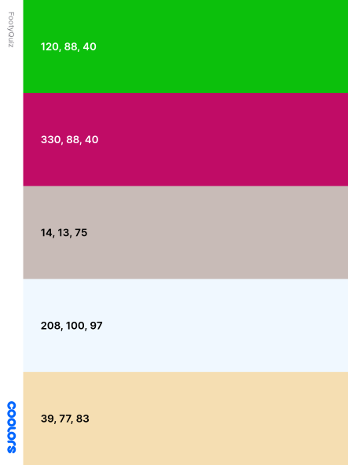

# FootyQuiz

[View the live project here.](https://awrelh.github.io/FootyQuiz/)

This is a football quiz for the fans of the biggest sport in the world.

<h2 align="center"></h2>

## User Experience (UX)

-   ### User stories

    As a user I want to play a quiz that is straight forward. 
    This is the question and those are the alternatives. I want to see how I progress while playing and at some point the game will let me know that the game if finished. I want to be challenged with questions that regards football and hopfully learn something. 

-   ### Design
    -   #### Colour Scheme
        -  the colorscheme I have used 
        
        
        
            I've used the HSL set-up because its efficent way to grade up and down through the colors. 
    -   #### Typography
        -   The font family I've used is Kanita, PT Sans Narrow, Sansita, sans-serif.
    -   #### Imagery
        -   I've used a banner image of a stadium and a ball on top, behind the welcome-text. And the additional imagery is soly complementing some of the questions where I found it adding value to the questions, flags for countries for example. 

*   ### Wireframes

    -   Home Page Wireframe - [View](assets/images/forREADME/footyQuizDesktop.png)

    -   Mobile Wireframe - [View](assets/images/forREADME/footyQuizMobile.png)

    -   Contact Us Page Wireframe - [View](https://github.com/) < not finished >

## Features

-   Responsive on all device sizes

-   Interactive game for everyone, but especially football lovers

-   Possibility to give feedback to creater or suggest questions

## Technologies Used

### Languages Used

-   [HTML5](https://en.wikipedia.org/wiki/HTML5)
-   [CSS3](https://en.wikipedia.org/wiki/Cascading_Style_Sheets)
-   [JavaScript](https://en.wikipedia.org/wiki/JavaScript)

### Frameworks, Libraries & Programs Used

1. [Google Fonts:](https://fonts.google.com/)
    - Google fonts were used top import fonts into the style.css file which is used on both pages.
1. [Font Awesome:](https://fontawesome.com/)
    - Font Awesome was used on to retrieve one icon of football. 
1. [Git](https://git-scm.com/)
    - Git was used for version control, use of commands as git add, git commit, git push. 
1. [GitHub:](https://github.com/)
    - GitHub is used to start the project via codeInstute template, and is coded via gitpod. 

1. [Balsamiq:](https://balsamiq.com/)
    - Balsamiq was used to create the wireframes during the start of project.

## Testing

The W3C Markup Validator and W3C CSS Validator Services were used to validate the pages of the project and make sure code is correct. Also JShint was used to validate the javascript. 

-   [W3C Markup Validator](https://jigsaw.w3.org/css-validator/#validate_by_input) - [Results](https://github.com/)
-   [W3C CSS Validator](https://jigsaw.w3.org/css-validator/#validate_by_input) - [Results](https://github.com/)

#
## index.html
    

-   #### Returning Visitor Goals

   

- 
### Further Testing

-   The Website was tested on Google Chrome, and Microsoft Edge.
-   The website was viewed on a variety of devices such as Desktop, Laptop, and phone and pad set up that is available on the developer tools in these browsers. 
-   

### Known Bugs

## Deployment

### GitHub Pages

The project was deployed to GitHub Pages using the following steps...

1. Go to GitHub and locate the [right repository](https://github.com/AwrelH/FootyQuiz)
2. Go to settings on the menu.  
3. Click on "Pages" Section.
4. Under "Source", change the dropdown option from "None" to "main".
5. Save the changes and let github do its work.
6. Within a couple of minutes you page is hosted on github and you get a link above "Source".

## Credits

### Code

### Content

-   All content was written by the developers.

-   Psychological properties of colours text in the README.md was found [here](http://www.colour-affects.co.uk/psychological-properties-of-colours)

### Media

-   All Images were sourced from.
    https://iconarchive.com/ for most the flags
    https://coolors.co/ were used to make a palette for my readme.
    google image searches
### Acknowledgements

